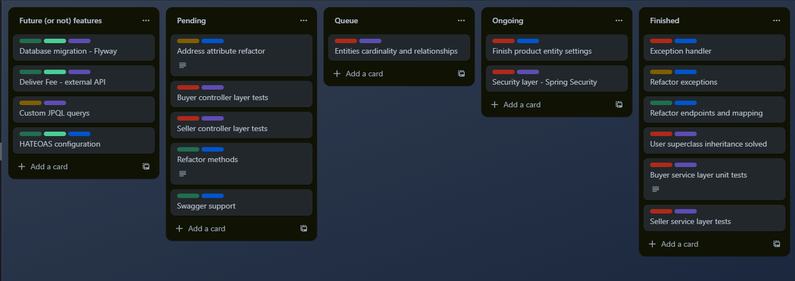
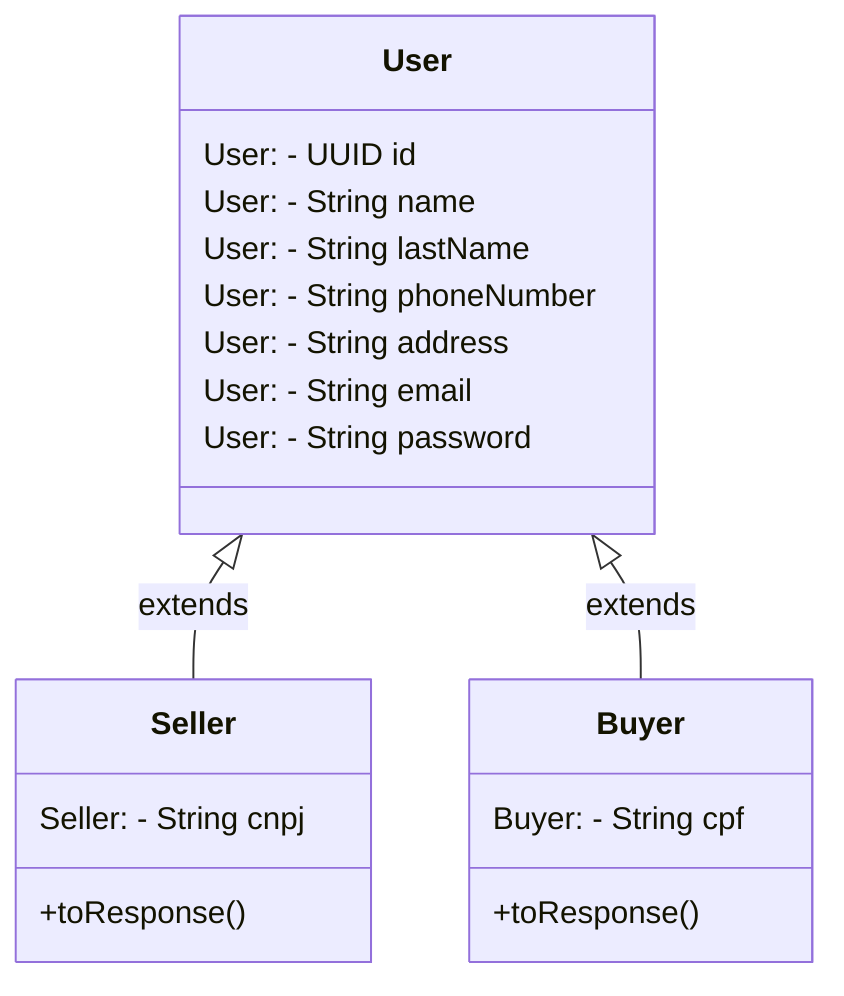

# Neithan's Store

<i>Neithan's Store é um e-commerce fictício que estou desenvolvendo para aplicar meus conhecimentos em Java utilizando o framework Spring Boot e que, futuramente será implementado em um front-end que será provavelmente desenvolvido em Angular. Neste repositório você poderá acompanhar o desenvolvimento do back-end da aplicação e abaixo a lista com algumas das tecnologias que estão implementadas no projeto e o Trello aonde organizo todo o processo de desenvolvimento e informações futuras features.</i>

### Versões:
- Java JDK 17
- Lombok versão: 1.18.28
- Spring Boot versão: 3.1.2
- Jakarta Validation versão: 3.0.2

### Tecnologias implementadas:
- Spring Data JPA, Security, MVC & Web
- JUnit 5 & Mockito para testes unitários
- HATEOAS (Hypermedia As the Engine Of Application State)
- PostgreSQL & H2 Database
- Jakarta Bean Validation
- Lombok

<h2 align="center">Trello</h2>

última atualização: 29/09/2023

  

<h2 align="center">Diagrama de classes do Usuário</h2>

última atualização: 02/10/2023

  User é uma classe abstrata mapeada que não é persistida no banco de dados, Seller e Buyer são especializações e herdam os atributos de User. Os métodos toResponse() presente nas classes Seller e Buyer são alternativas ao DozerMapper, ModelMapper ou similares para converter a entidade em um Form (DTO).

